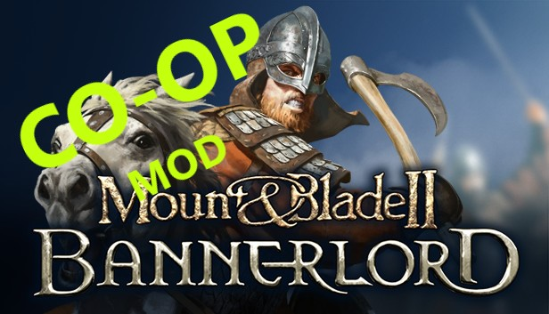

<!-- PROJECT LOGO -->
 

  

<h3 align="center">Mount & Blade II: Bannerlord CO-OP Mod</h3>

  

    This is just a barebone co-op modification made for fun. It is in no way playable, but can serve as a starting point for future endeavours.
     
    <a href="https://github.com/Andreas1331/MBCoop/tree/master/MBCoopMod"><strong>Explore the code</strong></a>
     
     
    
<i>Disclaimer: This is not affiliated nor endorsed by Taleworlds Entertainment.</i>

  

<!-- TABLE OF CONTENTS -->

  
Table of Contents

  <ol>
    <li><a href="#about-the-project">About The Project</a></li>
    <li>
      <a href="#getting-started">Getting Started</a>
      <ul>
        <li><a href="#prerequisites">Prerequisites</a></li>
      </ul>
    </li>
    <li><a href="#license">License</a></li>
    <li><a href="#contact">Contact</a></li>
  </ol>

<!-- ABOUT THE PROJECT -->
## About The Project

The project was intended to be a playground to learn more about TCP, and by extention the client-server architecture to create a modification that enables a real co-op experience to be enjoyed in Mount & Blade. 

Mount & Blade II: Bannerlord had at the time of starting this project just been released, without any co-op option, so it was a perfect option to also try and get accustomed with their API. The Visual Studio solution consists of three projects.
* MBCoopClient: contains game logic
* MBCoopLibrary: contains classes shared as dependencies
* MBCoopServer: the actual server

At the current stage this modification is basically just a shell to facilitate further development. A host is able to boot up a server on which other client can join. The initial idea was to have the host join the server as well, and the host would synchronize everything (read: events, NPC movement e.g) with other connected clients. The client and server logic is implemented and players can have their ingame parties synchronized, though it is only their location and movement being transmitted between clients. There's also a chat system implemented, that does what you'd expect. Sends messages between clients.

When this project was initially started Taleworld had internalized a substantial number of classes from their API. This makes modifying the game difficult, which is why the project relies on Harmony to patch methods.

(<a href="#readme-top">back to top</a>)

<!-- GETTING STARTED -->
## Getting Started

To get started I recommend opening the solution using Visual Studio 2019+ and run in debugmode. The settings in MBCoopClient will automatically build and output the DLL files to the required folder inside the Mount & Blade installation folder. After building, Visual Studio will start your game as well, and fire up the server from the MBCoopServer project. 
Follow the steps below to set up the paths for your installation.
* Inside Visual Studio 2019+ -> MBCoopClient -> properties -> Debug  From here change the 'Start external program' and 'Working directory' so they match your path

### Prerequisites

Make sure to have the following frameworks at hand. The collection of DLLs from Taleworlds will be available from your installation folder. So either install the game, or find any archive online to download them from.
* .NET Framework 4.7.2
* Harmony 2.x
* Taleworlds.x DLLs

(<a href="#readme-top">back to top</a>)

<!-- LICENSE -->
## License

Distributed under the MIT License. See `LICENSE.txt` for more information.

(<a href="#readme-top">back to top</a>)

<!-- CONTACT -->
## Contact

Andreas  - **Website to be inserted**

(<a href="#readme-top">back to top</a>)

<!-- ACKNOWLEDGMENTS -->
## Acknowledgments

* [The Youtube channel by Tom Weiland gave a solid understanding on TCP using C#](https://www.youtube.com/c/TomWeiland)
* [The free to use library Harmony by Andreas Pardeike for patching methods at runtime](https://harmony.pardeike.net/)

(<a href="#readme-top">back to top</a>)

